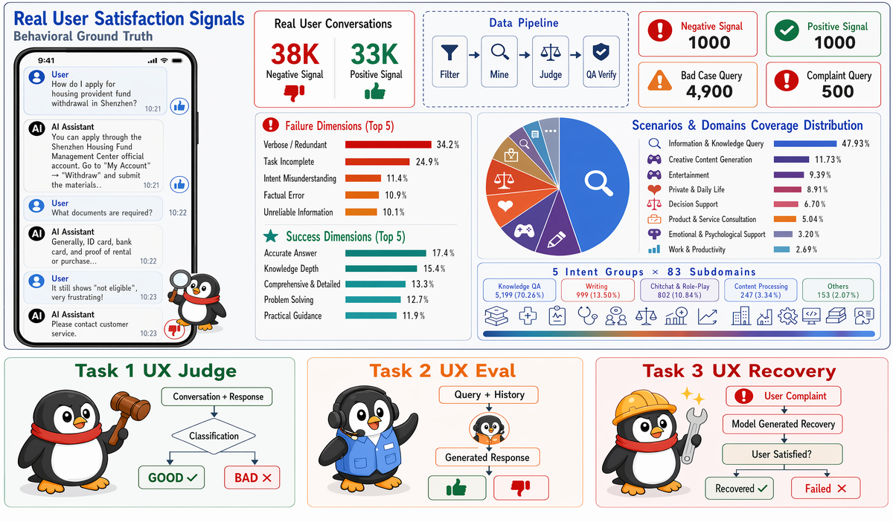

<div align="center">

#  &nbsp;UXBench: Benchmarking User Experience in AI Assistants

[](https://arxiv.org/abs/2606.09570) [](https://huggingface.co/datasets/mengze-hong/UXBench) [](https://mengze-hong.github.io/UXBench) [](LICENSE) [](https://python.org)

**[🏆 Leaderboard](https://mengze-hong.github.io/UXBench) · [📄 Paper](https://arxiv.org/abs/2606.09570) · [🤗 Dataset](https://huggingface.co/datasets/mengze-hong/UXBench)**

</div>

---

## 📖 Overview

UXBench is the first user-centric LLM benchmark grounded in **real user feedback signals**, built from 70K+ thumbs-up and thumbs-down conversations from Tencent Yuanbao. It evaluates LLMs across three UX tasks (Judge, Eval, Recovery) covering 8 interaction scenarios and 83 domains. The goal is to extend LLM benchmarking from capabilities to user-perceived utility, shaping the future success of AI assistants.

<div align="center">
  
</div>

---

## 📊 Dataset Formulation

UXBench defines three evaluation tasks over test sets derived from real interaction logs, totalling 7,400 test instances across 8 interaction scenarios and 83 domains.

| Split | Task | Size | Description | Metric |
|-------|------|-----:|-------------|--------|
| Task 1 | UX Judge | 1,000 | Disliked conversations (10 failure dimensions) | Bad-Acc |
| Task 1 | UX Judge | 1,000 | Liked conversations (8 success patterns) | Good-Acc |
| Task 2 | UX Eval | 4,900 | Multi-turn conversations, response generation | Good% (GRM-rated) |
| Task 3 | UX Recovery | 500 | Failed conversations, recovery generation | Recovery Rate (Good%) |
| **Total** | | **7,400** | 8 scenarios · 83 domains | — |

**Task 1 · UX Judge** evaluates whether a model can correctly classify a response as good or bad. The primary metric is **Avg-Acc = (Good-Acc + Bad-Acc) / 2**, aiming to obtain a well-calibrated model that can accurately identify unsatisfactory responses.

**Task 2 · UX Eval** requires a model to generate a satisfying response given a user query and dialogue history. Responses are scored by a trained GRM (Pointwise GRM).

**Task 3 · UX Recovery** requires a model to repair a failed interaction after an explicit user complaint. **Recovery Rate** measures the fraction of generated responses rated as satisfying by the GRM.


### Download Dataset

The test set files are hosted on HuggingFace. Download them before running evaluation:

```python
from datasets import load_dataset

bad  = load_dataset("mengze-hong/UXBench", "task1_judge_bad",  split="test")
good = load_dataset("mengze-hong/UXBench", "task1_judge_good", split="test")
t2   = load_dataset("mengze-hong/UXBench", "task2_eval",       split="test")
t3   = load_dataset("mengze-hong/UXBench", "task3_recovery",   split="test")
```

---

## 🗂️ Repository Structure

```
UXBench/
├── src/
│   ├── pipeline/              # Data construction pipeline (6 stages)
│   │   ├── pipeline.py        # Main orchestrator (ThreadPool)
│   │   ├── signals.py         # Stage 0: signal extraction
│   │   ├── prefilter.py       # Stage 1: dedup + quality filter
│   │   ├── miner.py           # Stage 2: miner agent
│   │   ├── judge.py           # Stage 3: judge agent (5-axis scoring)
│   │   ├── qa_full_scan.py    # Stage 4: QA full scan
│   │   ├── build_golden_testset.py  # Stage 5: golden set construction
│   │   └── prompts/           # Pipeline system prompts (Chinese)
│   │       ├── miner_system.txt
│   │       ├── judge_system.txt
│   │       └── qa_system.txt
│   └── utils/
│       ├── config.py          # API config (env-based, single key)
│       ├── llm_client.py      # Unified LLM client
│       ├── checkpoint.py      # Resume-safe checkpointing
│       ├── data_loader.py     # JSONL I/O helpers
│       └── prompts.py         # Eval prompts (POINTWISE_GRM + verdict parsing)
│
├── scripts/
│   ├── run_eval.py            # Task 1/2/3 evaluation runner
│   └── grm_judge/
│       ├── run_grm_judge_task2.py  # GRM scorer for Task 2
│       └── run_grm_judge_task3.py  # GRM scorer for Task 3
│
├── experiments/
│   ├── configs/
│   │   └── eval_config.yaml
│   └── results/
│       ├── task1_leaderboard.md
│       └── task2_leaderboard.json
│
├── tools/
│   └── dashboard/
│       └── app.py             # FastAPI visualization dashboard
│
├── assets/
│   └── figures/               # Paper figures
│       ├── fig_uxbench_overview.png
│       └── fig_task2_timeline.png
│
├── docs/                      # GitHub Pages leaderboard
│   ├── index.html
│   ├── css/style.css
│   ├── js/leaderboard.js
│   └── img/
│
├── requirements.txt
├── .gitignore
├── LICENSE
└── README.md
```

---

## 🚀 Quick Start

### 1. Install

```bash
git clone https://github.com/mengze-hong/UXBench
cd UXBench
pip install -r requirements.txt
```

### 2. Configure API key

```bash
export OPENAI_API_KEY=sk-...
# Optional: custom base URL for non-OpenAI providers
# export OPENAI_API_BASE=https://your-endpoint/v1
```

### 3. Run Evaluation

```bash
# Task 1: UX Judge
python scripts/run_eval.py \
  --task task1_ux_judge \
  --model claude-opus-4.7 \
  --config experiments/configs/eval_config.yaml

# Dry run (first 10 examples only)
python scripts/run_eval.py --task task1_ux_judge --model claude-opus-4.7 --dry-run
```

### 4. Launch Dashboard

```bash
python -m uvicorn tools.dashboard.app:app --port 8512
```

---

## 📝 Citation

```bibtex
@misc{hong2026uxbench,
  title         = {UXBench: Benchmarking User Experience in AI Assistants},
  author        = {Mengze Hong and Xia Zeng and Zeyang Lei and Sheng Wang and
                   Chen Jason Zhang and Di Jiang and others},
  year          = {2026},
  eprint        = {2606.09570},
  archivePrefix = {arXiv},
  primaryClass  = {cs.CL},
  url           = {https://arxiv.org/abs/2606.09570}
}
```

---

## ⚖️ License

**Key restrictions:** research use only &nbsp;·&nbsp; no redistribution &nbsp;·&nbsp; no derivative datasets &nbsp;·&nbsp; no commercial use

Please contact [mengze.hong@connect.polyu.hk](mailto:mengze.hong@connect.polyu.hk) and [zeyanglei@gmail.com](mailto:zeyanglei@gmail.com) for permission-related matters.

---

<div align="center">
  <sub>
    <a href="https://mengze-hong.github.io/UXBench">🏆 Leaderboard</a> &nbsp;·&nbsp;
    <a href="https://arxiv.org/abs/2606.09570">📄 arXiv</a> &nbsp;·&nbsp;
    <a href="https://huggingface.co/datasets/mengze-hong/UXBench">🤗 Dataset</a>
  </sub>
</div>
